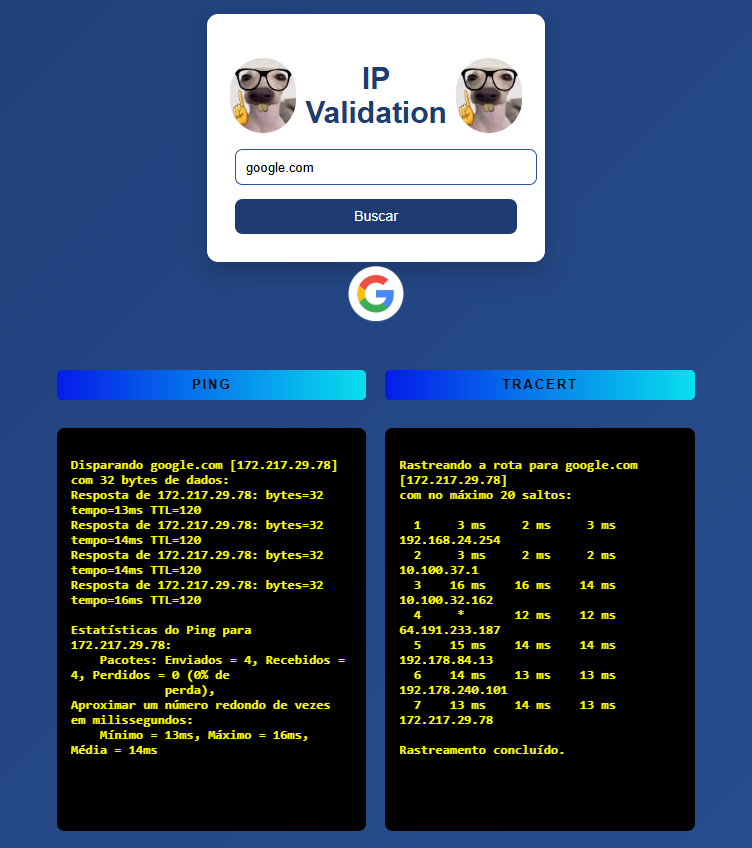
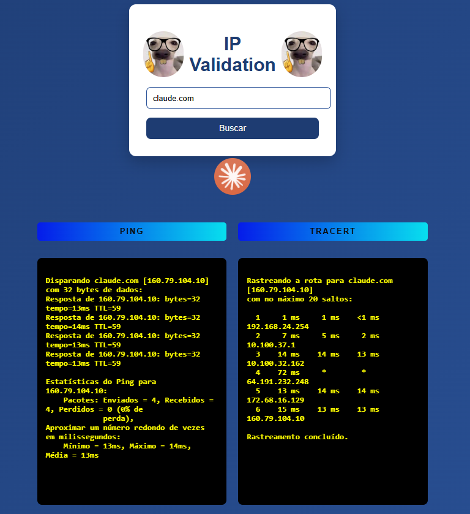

# IP-Validation


**Validador de IP com Ping e Traceroute** — Uma aplicação web simples e interativa para validar endereços IP e realizar testes diretamente pelo navegador.

---


## ✨ Funcionalidades

- Validação em tempo real de endereços IPv4
- Teste de **Ping** (4 pacotes)
- Execução de **Traceroute** (rastreamento de rota)
- Interface moderna e responsiva
- Suporte automático a Windows (`tracert`) e Linux/macOS (`traceroute`)
- Feedback instantâneo com JavaScript

---

## 🛠️ Tecnologias Utilizadas

- **Backend**: Python + Flask
- **Frontend**: HTML5, CSS3 e JavaScript (Vanilla)
- **Comunicação**: Fetch API + JSON
- **Sistema**: `subprocess` para executar `ping` e `traceroute`/`tracert`

---


### Ping pro Google



### Ping pro Claude



## 🚀 Como Executar

### Pré-requisitos

- Python 3.8 ou superior

### Instalação

```bash
# Clone o repositório
git clone https://github.com/Gustavo-Alve/IP-Validation.git
cd IP-Validation

# Crie e ative o ambiente virtual (recomendado)
python -m venv venv

# Windows
venv\Scripts\activate

# Linux / macOS
source venv/bin/activate

# Instale as dependências
pip install flask

# Execute a aplicação
python app.py


📁 Estrutura do Projeto
textIP-Validation/
├── app.py                    # Aplicação principal (Flask)
├── templates/
│   └── index.html            # Página principal
├── static/
│   ├── css/
│   └── js/                   # Scripts JavaScript
├── coisa_que_aprendi.txt     # Anotações de aprendizado
├── ping_google_img.png
├── ping_claude_img.png
└── README.md


Desenvolvido Por Gustavo Alves